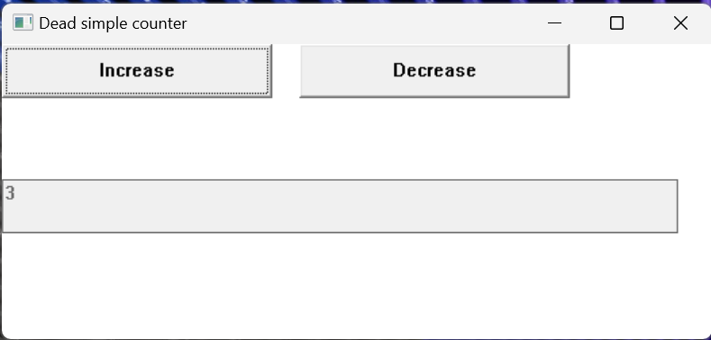
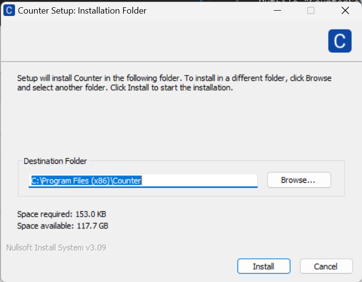
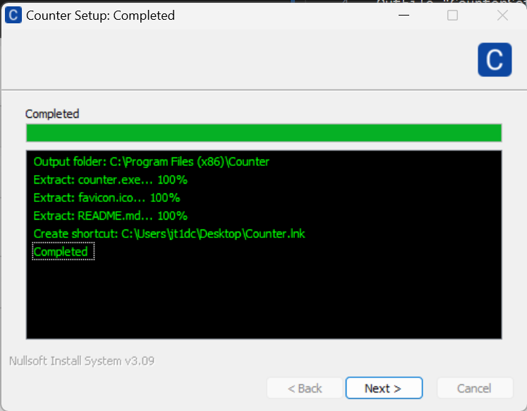
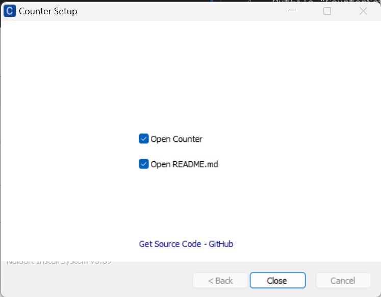

# dead-simple-counter-win-rs
A dead simple counter windows app written in Rust with windows-rs library for demonstration purpose. You can use this app as Your First Windows Application.



# Develop

- Rust
- Win32 API
- NSIS
- GitHub Action

# Files

## main.rs

It's a good practice to have a struct to hold the states of your app instead of using global variables. So we define struct `Counter` which has two fields: `counter` and `output_handle` and initiate in main function with `Box::leak` to retrive the pointer of the Counter. We pass the pointer to `CreateWindowExW` as lpparam argument. Here is the brif code.

```rust
struct Counter {
    counter: i32,
    output_handle: HWND,
}

let lparam: *mut Counter = Box::leak(Box::new(Counter{
    counter: 1,
    output_handle: HWND(0),
}));

let hwnd = CreateWindowExW(
    // ... ...
    Some(lparam as *mut c_void),
);
```

We can only receive this pointer on `VM_CREATE` message once, so what we should do next is to store the value to `GWLP_USERDATA` which is allocated by windows. then we are able to access this pointer on every message reached. 

```rust
// Pseudocode
fn window_proc(_, _, _, lparam: LPARAM) {
    if is WM_CREATE message {
        let cs = lparam.0 as *const CREATESTRUCTW;
        let counter = (*cs).lpCreateParams as *mut Counter;
        SetWindowLongPtrW(hwnd, GWLP_USERDATA, counter as _);
    },
}
```

To access the pointer we can use 
```rust
let counter_ptr = GetWindowLongPtrW(parent, GWLP_USERDATA) as *mut Counter;
if let Some(c) = counter_ptr.as_mut() {
    c.counter += delta;
}
```

It's not easy for me to accomplish all this stuff, I have asked for help in StackOverflow, [this is the post](https://stackoverflow.com/questions/77741309/how-to-retrieve-a-struct-in-window-proc-function-in-wm-command-msg/77742557#77742557), and eventually I found the solution on GitHub [robmikh/minesweeper-rs](https://github.com/robmikh/minesweeper-rs/blob/8a8aa8bb127d961264b1f69368292d363bb66aa0/src/window.rs#L144-L156C8).


## counter.sni

[NSIS](https://nsis.sourceforge.io/Main_Page) is a professional open source system to create Windows installers, it's widely used in open source projects. 

Choose installation folder


Details of processing



Finished page


## .github/workflows/release.yml

Thanks to GitHub Action we can effortlessly build our releases. It runs on [Windows Server 2022](https://github.com/actions/runner-images/blob/main/images/windows/Windows2022-Readme.md) to build app with Rust and NSIS. The image GitHub provided has already installed most developing languages and runtimes including Rust and NSIS.  Then run `cargo build --release` to build app from `src/main.rs`. After building the app all files are fulfilled, we can run `makensis counter.sni` to package app resources and setup instructions into `CounterSetup.exe`. Finally we upload the binary to GitHub release as an asset for users to download.
